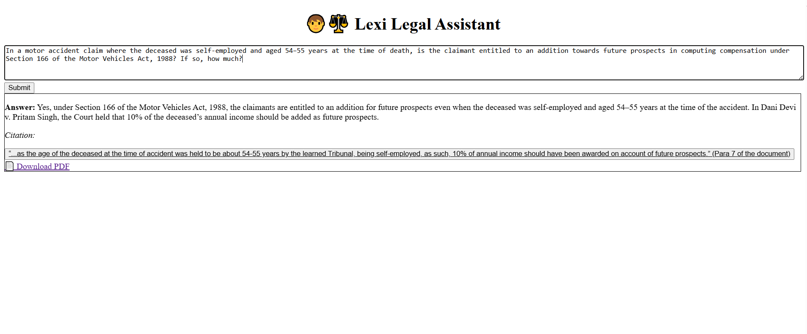

# Lexisg-frontend-intern-test

🧑‍⚖️ **Lexi Legal Assistant – Frontend Assignment**

This project simulates a legal assistant (like Lexi) that answers legal queries and provides citations from court documents. It replicates how Lexi helps users trace AI-generated answers back to real case law documents.

---

## ✨ Features

- ✅ Ask a legal question
- ✅ View a generated legal answer
- ✅ See one or more citation excerpts
- ✅ Clickable citation that opens a PDF in a built-in viewer
- ✅ Download the cited PDF
- ✅ Simulated paragraph highlighting inside the PDF viewer

---

## 🧪 Simulated Query Used

**Question:**

> In a motor accident claim where the deceased was self-employed and aged 54–55 years at the time of death, is the claimant entitled to an addition towards future prospects in computing compensation under Section 166 of the Motor Vehicles Act, 1988? If so, how much?

**Answer:**

> Yes, under Section 166 of the Motor Vehicles Act, 1988, the claimants are entitled to an addition for future prospects even when the deceased was self-employed and aged 54–55 years... In _Dani Devi v. Pritam Singh_, the Court held that 10% of the deceased’s annual income should be added.

**Citation (shown below answer):**

> "...10% of annual income should have been awarded on account of future prospects." (Para 7)

---

## 📄 Citation Handling

- Displays a clickable citation under the answer.
- Clicking opens the built-in PDF viewer in the UI.
- The viewer simulates scrolling to Paragraph 7 or highlighting it.
- A download button is available to download the full judgment PDF.

---

## 🧑‍💻 Tech Stack

- React.js (Vite)
- Tailwind CSS for styling
- `react-pdf` for PDF rendering
- Simulated POST API (no backend used)

---

## 📸 Screenshot

Here’s a preview of the UI with the question, answer, and citation visible:



---

## 📦 Installation & Running Locally

```bash
# Clone the repository
git clone https://github.com/YOUR_USERNAME/Lexisg-frontend-intern-test.git

# Navigate into the project folder
cd lexisg-frontend-intern-test

# Install dependencies
npm install

# Run the development server
npm run dev
```
